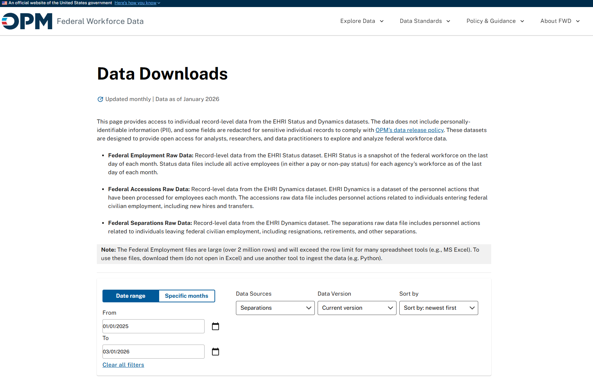

# Separation Anxiety

This is the home page of an Observable Framework app exploring *OPM Separation Data*. 

The original JSON files can be downloaded directly from the [Office of Personnel Management](https://data.opm.gov/explore-data/data/data-downloads) using the options selected in the image below. The raw data is in about as bad of shape as you would expect from OPM, so a reference Jupyter Notebook is included at [the end of this project](separation-process.md). The notebook was used to clean the raw JSON files using pandas prior to exporting to parquet for use here in the Observable Framework. 

Additional features will be added over time. This is still in the experimental phase. Feedback is welcome! 

For more information on the Observable Framework, see <https://observablehq.com/framework/getting-started>.