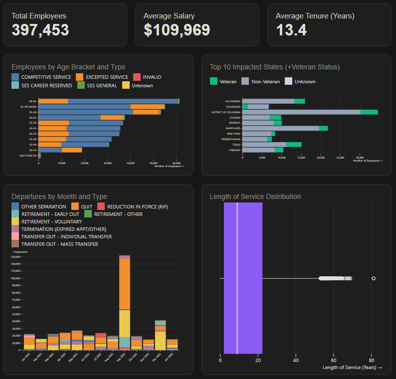

# Separation Anxiety

On September 30, 2025, we joined over 100k other federal employees in what was likely the largest single day resignation in US history. Nearly 400k federal employees would leave their roles between January 2025 and January 2026. There have been countless stories describing the loss. This project is an effort to allow the public to learn more about those who those employees were and what they left behind.

*Separation Anxiety* is a data visualization app exploring OPM separation data. The original data can be downloaded directly from the [Office of Personnel Management](https://data.opm.gov/explore-data/data/data-downloads) using the options selected in the image below. The raw data is in about as bad of shape as you would expect from OPM, so a reference Jupyter Notebook is included at [the end of this project](./separation-process). The notebook was used to clean the raw JSON files prior to exporting to parquet for use here. 

If you find this project useful, please consider supporting us on Ko-fi. If you haven't checked out our [podcast](https://forkingoff.com) yet, please do. We interview the former feds found in the data and hear their stories first hand.

Additional features will be added over time. This is still in the experimental phase. Feedback is welcome! 

## [Explore the Data on the Next Page](./dashboard)

This project was built with the [Observable Framework](https://observablehq.com/framework/getting-started). Learn more about how it works on [GitHub](https://github.com/hax4libre/separation-anxiety).